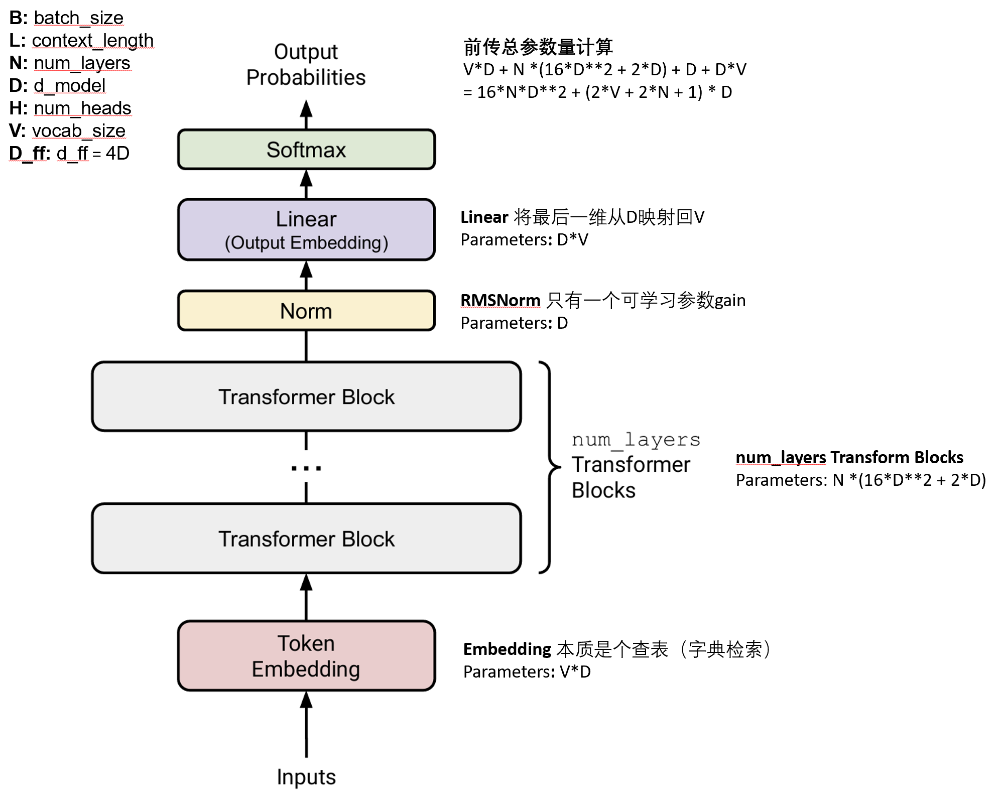
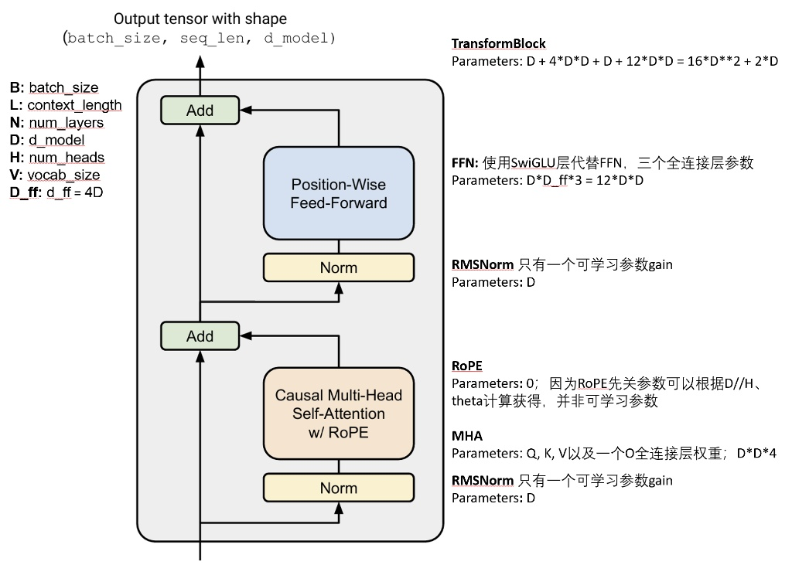

### Resource accounting for training with AdamW

**parameters:** $16*N*D^2 + (2*V + 2*N + 1) * D * 4$ （字节）

**gradients:** 与paramters相等

**optimizer state:** 内部包含m,v两个临时参数，参数量与parameters相同，因此是$32*N*D^2 + (4*V + 4*N + 2)*D$ （字节）

**activations: ** 记录在计算过程中最大的临时参数量；

$(B*H*L*L + B*L*4D) * 4$ （字节）

#### FLOPs计算

※只计算乘·加计算量

#### 1. 多头自注意力 (MHA) 子层

MHA 中计算量的大头是四个线性投影层 (Q, K, V, Output)。

- **Q, K, V, Output Projections**: 每个都是一个 `Linear(D, D)` 的全连接层。
  - 对一个 `Linear(D, D)` 层，输入为 `(B, L, D)`，其 FLOPs 约为 2×B×L×D×D=2⋅B⋅L⋅D⋅D。
  - 因为有 **4** 个这样的层，所以这部分的 FLOPs 是：
  - **FLOPs (MHA Proj) = 4×(2⋅B⋅L⋅D2)=8⋅B⋅L⋅D⋅D**

#### 2. SwiGLU FFN 子层

这个 FFN 包含三个线性层。

- **`gate_proj` (Linear(D, D_ff))**: `D_ff = 4D`
  - FLOPs ≈2×B×L×D×Dff=2×B×L×D×(4D)=8⋅B⋅L⋅D⋅D
- **`up_proj` (Linear(D, D_ff))**: 与 `gate_proj` 相同。
  - FLOPs ≈8⋅B⋅L⋅D⋅D
- **`down_proj` (Linear(D_ff, D))**:
  - FLOPs ≈2×B×L×Dff×D=2×B×L×(4D)×D=8⋅B⋅L⋅D⋅D
- **FFN 的总 FLOPs**:
  - **FLOPs (FFN) = 8BLD2+8BLD2+8BLD2=24⋅B⋅L⋅D⋅D**

#### ３. 前传总计算量

FW_FLOPs = 8⋅B⋅L⋅D⋅D + 24⋅B⋅L⋅D⋅D = 32⋅B⋅L⋅D⋅D

#### 4. 方向传播

BW_FLOPs = 2 * FW_FLOPs = 64⋅B⋅L⋅D⋅D

#### 5. 全部计算量

TOTAL_FLOPs = FW_FLOPs + BW_FLOPs = 96⋅B⋅L⋅D⋅D

